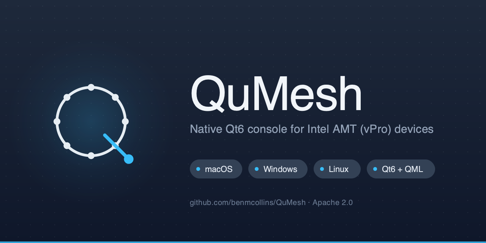

<p align="center">
  
</p>

<h1 align="center">QuMesh</h1>

<p align="center">
  <strong>A native Qt6 / QML console for Intel AMT (vPro) devices.</strong><br/>
  Cross-platform (macOS · Windows), with a one-shot importer for configurations saved by the legacy NW.js MeshCommander.
</p>

<p align="center">
  <a href="https://github.com/benmcollins/QuMesh/actions/workflows/ci.yml"></a>
  <a href="https://github.com/benmcollins/QuMesh/releases"></a>
  <a href="LICENSE.md"></a>
  
  
</p>

---

## What it does

QuMesh manages Intel AMT (vPro) hardware over WSMAN and the Intel redirection protocol — power control, hardware inventory, event-log retrieval, serial-over-LAN, IDE-R (mount a local ISO as a remote drive), and KVM. It replaces Intel's NW.js-wrapped [MeshCommander](https://github.com/Ylianst/MeshCommander) with a native Qt6 app, removing the embedded Chromium and the surrounding 1.1 GB bundle.

**Why a rewrite.** The legacy app is fragile against Node/Chromium API churn (saved configs broke when Node 22 dropped `crypto.createCipher`), the bundle is enormous, and the codebase is hard to extend. A native Qt app gives proper desktop integration and lets the UI evolve without touching a 3 MB single-page web app.

## Features

- **WSMAN client** — connect, inventory, power control, event log, power-state changes.
- **Redirection transport** — TLS on 16994/16995 with Intel's framing.
- **Serial-over-LAN terminal** — a QML VT100 widget on top of the redirection channel.
- **IDE-R** — mount a local ISO as remote IDE/USB.
- **KVM viewer** — Intel's RFB-variant codec with input forwarding.
- **Certificate store** — import/export, pinning, mutual-TLS hook.
- **One-shot migration** — reads the legacy app's Chromium `localStorage` (machines + certs) and decrypts both the legacy and `v2:` AES envelopes.
- **In-app auto-update** — Sparkle on macOS, WinSparkle on Windows.
- **Self-contained installers** — `.dmg` (macOS, drag-to-Applications) and NSIS `.exe` (Windows), Qt + OpenSSL bundled.

## Quick start

### Build from source

```bash
# macOS — install Qt 6.6+, Ninja, libssh:
brew install qt ninja libssh

cmake -S . -B build -G Ninja -DCMAKE_PREFIX_PATH=/opt/homebrew/opt/qt
cmake --build build
ctest --test-dir build --output-on-failure
```

Run it:

```bash
./build/app/qumesh.app/Contents/MacOS/qumesh    # macOS
build\app\qumesh.exe                            # Windows
```

Windows: install Qt 6.6+ (`win64_msvc2022_64`), OpenSSL 3, and libssh from vcpkg. Set `CMAKE_PREFIX_PATH` to the Qt install and pass `-DCMAKE_TOOLCHAIN_FILE=<vcpkg>/scripts/buildsystems/vcpkg.cmake`. The [CI workflow](.github/workflows/ci.yml) is the canonical reference.

### Download a release

Grab the `.dmg` (macOS) or `.exe` (Windows) installer from the [Releases page](https://github.com/benmcollins/QuMesh/releases). Bundles include Qt, OpenSSL, and libssh — no extra installs needed. See [`PACKAGING.md`](PACKAGING.md) for what's inside the bundle, code-signing, and the in-app auto-update flow.

## Repository layout

```
.                        QuMesh — the active Qt6/QML rewrite
├── app/                 main application + QML UI + tests
├── certs/               certificate store (load/save, pinning, mutual-TLS)
├── ider/                IDE-R framing on top of redirection
├── kvm/                 KVM codec + viewer
├── migrate/             one-shot import from legacy localStorage/leveldb
├── redir/               Intel redirection transport (TLS, framing)
├── ssh/                 per-machine SSH tunnel
├── terminal/            VT100 terminal core (for SOL)
├── wsman/               AMT WSMAN client + CLI smoke tool
└── branding/            logo SVGs, icon builder, social preview
```

## Contributing

Workflow for any non-trivial change:

1. Open an issue describing the change.
2. Branch as `<issue#>-<short-desc>` (e.g. `97-ssh-tunnel`).
3. Comment your implementation plan on the issue *before* writing code.
4. Implement on the branch. Tests are required for new code.
5. Open the PR; CI builds and tests on macOS + Windows.
6. Merge once both runners are green.

More detail and Qt/QML conventions in [`CLAUDE.md`](CLAUDE.md).

## License

Apache 2.0 — see [`LICENSE.md`](LICENSE.md). Includes inherited code from Intel's MeshCommander (also Apache 2.0); per-file SPDX headers in the new Qt rewrite attribute Ben Collins.
